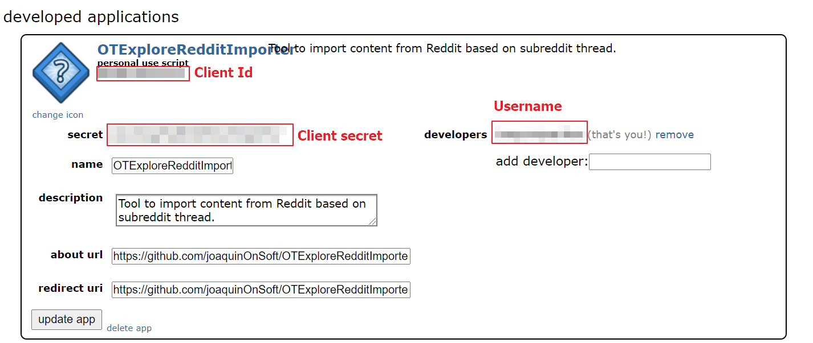
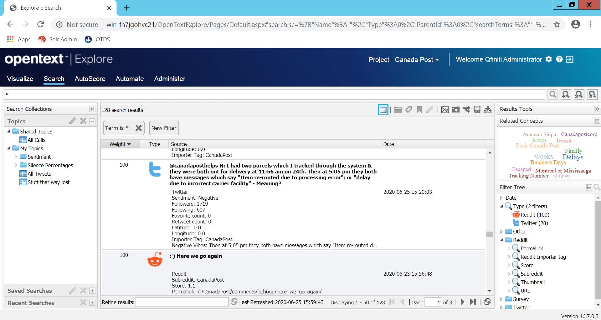
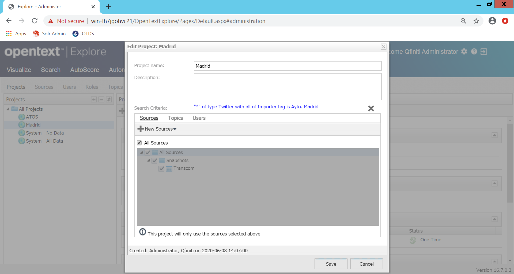
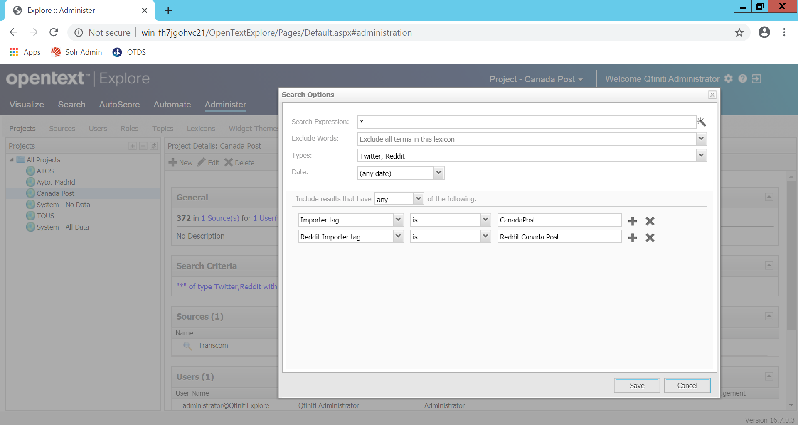

# OTExploreRedditImporter
Reddit importer for OpenText Explore (Voice of the customer solution)
This command-line application pool Reddit thread periodically, to ingest the Submissions (Article/Post) of our interest. 

These submissions are inserted into the Solr Server used by **OpenText Explore**. 

Once the Submission are available in **OpenText Explore** you can create your owns dashboards to analyze the information listened.


> [OpenText™ Explore](https://www.opentext.com/products-and-solutions/products/customer-experience-management/contact-center-workforce-optimization/opentext-explore) is a business discovery solution that allows business and call center professionals to view cross-channel interactions collectively for a comprehensive picture of customer behaviors and relationships. 

## Development environment configuration

### Reddit API

#### Create a reddit OAuth2 app
Reddit uses OAuth2 to authenticate 3rd party apps. The first thing you'll need to do is to register your app [here](https://www.reddit.com/prefs/apps). For the sake of simplicity, let's create a script app.



You'll need the client ID and client secret later.

## Configuration file: reddit.properties

Configuration file that specifies the credentials to use the Reddit API:

It supports theses properties:

 * **username**: Reddit user name
 * **password**: Reddit user password
 * **clientID**: Reddit client unique identifier (Personal use script)
 * **clientSecret**: Reddit client secret (Secret)

This *reddit.properties** file shows an example: 
```
username=********
password=********
clientID=********
clientSecret=********
```

> Place it to either the current directory, root of the CLASSPATH directory.


## Command line execution 

This utility is distributed as a runnable .jar file.

These are the accepted parameters:

usage: java -jar OTExploreRedditImporter-20.2.jar
 * -h, --host			(Optional)		Solr host URL (used by OpenText Explore). Default value: http://localhost:8983
 * -i, --itag			(Optional)		Explore Importer tag. Added to each article importer. Default value: "Reddit"
 * -s, --subreddit		(Mandatory)		Subreddit thread name 

### Example of invocation

```
$ java -jar OTExploreRedditImporter-20.2.jar --subreddit CanadaPost --itag CanadaPost 

$ java -jar OTExploreRedditImporter-20.2.jar --subreddit CanadaPost --itag CanadaPost --host http://localhost:8983
```

## Explore configuration

### Explore.Configuration.xml

The configuration file **Explore.Configuration.xml** is located at **<EXPLORE_HOME>\Explore.Configuration.xml**, e.g. 

```
D:\Program Files (x86)\OpenText\Explore\Explore.Configuration.xml 
```

#### Reddit DocType

We must add a new DocType tag under the **<DocTypes>** in Explore.Configuration.xml in order to identify Twitter as a new input/document type analyzed by Explore:

```xml
  <DocTypes>
    ...  
    <DocType>
      <Name>Reddit</Name>
      <GridFields>
        <Field column="Source">
          <Name>Subreddit</Name>
          <Tag>subreddit</Tag>
        </Field>
        <Field column="Source">
          <Name>Score</Name>
          <Tag>score</Tag>
        </Field>
        <Field column="Source">
          <Name>Permalink</Name>
          <Tag>permalink</Tag>
        </Field>
        <Field column="Source">
          <Name>URL count</Name>
          <Tag>url</Tag>
        </Field>
        <Field column="Source">
          <Name>Thumbnail</Name>
          <Tag>thumbnail</Tag>
        </Field>
        <Field column="Source">
          <Name>Importer Tag</Name>
          <Tag>itag</Tag>
        </Field>
    <DocType>
  </DocTypes>
```


#### Group Twitter


We must add a new **Group** tag under the **<DoCriteriaItemscTypes>** in Explore.Configuration.xml in order to identify Reddit submissions as a new group that can be used to filter by:

```xml
  <!--<CriteriaItem parametric="true" advancedSearch="true" trendWidget="true" autoPopulate="true" reloadUserData="true" groupBy="single" numberBuckets="6">
    parametric:     Show criteria item in the filter section on the search tab. Default value: false
    advancedSearch: Show criteria in the advanced search dialog. . Default value: true
    trendWidget:    Display criteria in the trend widget settings dialog. Only to be used with numeric criterias. Default value: false
    reloadUserData: Allows to reload user values for a parametric criteria. EG MAS Source. Default value: false
    groupBy:        Allows to group values in 3 ways: "single", "numeric" or "alphabetical"
    numberBuckets:  Number of buckets when gruping using numeric or alphabetical. Default value: 5
    numericStats:   Numeric criteria to be used in the Statistical Summary or in the High and Low Comparison widget.    
    -->

  <CriteriaItems>
  
    ...
      
    <Group name="Reddit">	             
      <CriteriaItem parametric="true" groupBy ="alphabetical" numberBuckets="20">
        <Name>Subreddit</Name>
        <Tag>subreddit</Tag>
        <ComparatorGroup>string</ComparatorGroup>
        <AssociatedDocTypes>
          <DocType>Reddit</DocType>
        </AssociatedDocTypes>
      </CriteriaItem>

      <CriteriaItem parametric="true" groupBy ="numeric" numberBuckets="10" advancedSearch="true" numericStats="true">
        <Name>Score</Name>
        <Tag>score</Tag>
        <ComparatorGroup>numeric</ComparatorGroup>
        <AssociatedDocTypes>
          <DocType>Reddit</DocType>
        </AssociatedDocTypes>		
      </CriteriaItem>	  

      <CriteriaItem parametric="true" groupBy ="alphabetical" numberBuckets="20">
        <Name>Permalink</Name>
        <Tag>permalink</Tag>
        <ComparatorGroup>string</ComparatorGroup>
        <AssociatedDocTypes>
          <DocType>Reddit</DocType>
        </AssociatedDocTypes>
      </CriteriaItem>

      <CriteriaItem parametric="true" groupBy ="alphabetical" numberBuckets="20">
        <Name>URL</Name>
        <Tag>url</Tag>
        <ComparatorGroup>string</ComparatorGroup>
        <AssociatedDocTypes>
          <DocType>Reddit</DocType>
        </AssociatedDocTypes>
      </CriteriaItem>	
      
      <CriteriaItem parametric="true" groupBy ="alphabetical" numberBuckets="20">
        <Name>Thumbnail</Name>
        <Tag>thumbnail</Tag>
        <ComparatorGroup>string</ComparatorGroup>
        <AssociatedDocTypes>
          <DocType>Reddit</DocType>
        </AssociatedDocTypes>
      </CriteriaItem>	        

    </Group>  
  
    ...
  
  </CriteriaItems>    
```


### schema.xml (Solr)

The Solr configuration file **schema.xml** is located at **<SOLR_HOME>\solr-7.3.1\server\solr\configsets\interaction_config** e.g. 

```
D:\SolrCloud\solr-7.3.1\server\solr\configsets\interaction_config
```

#### New Twitter fields on Solr

We must define new fields to be able to import extra metadata related with each Reddit submission 

```xml

  <!-- ADD YOUR CUSTOM FIELDS HERE -->

  <field name="subreddit" type="string" indexed="true" stored="false" docValues="true" />
  <field name="subreddit_search" type="explore_filter_text" indexed="true" stored="false" multiValued="true" />
  <copyField source="subreddit" dest="subreddit_search" />

  <field name="score" type="pint" indexed="true" stored="false" docValues="true" />
  <field name="score_search" type="explore_filter_text" indexed="true" stored="false" multiValued="true" />
  <copyField source="score" dest="score_search" />

  <field name="permalink" type="string" indexed="true" stored="false" docValues="true" />
  <field name="permalink_search" type="explore_filter_text" indexed="true" stored="false" multiValued="true" />
  <copyField source="permalink" dest="permalink_search" />
  
  <field name="url" type="string" indexed="true" stored="false" docValues="true" />
  <field name="url_search" type="explore_filter_text" indexed="true" stored="false" multiValued="true" />
  <copyField source="url" dest="url_search" />
  
   <field name="thumbnail" type="string" indexed="true" stored="false" docValues="true" />
  <field name="thumbnail_search" type="explore_filter_text" indexed="true" stored="false" multiValued="true" />
  <copyField source="thumbnail" dest="thumbnail_search" />   
  
  <field name="itag" type="string" indexed="true" stored="false" docValues="true" />
  <field name="itag_search" type="explore_filter_text" indexed="true" stored="false" multiValued="true" />
  <copyField source="itag" dest="itag_search" />


  <!-- END CUSTOM FIELDS -->
```

> **NOTE:** Field must be named using lowercase


### Applying changes on your instance

Once you have modified **Explore.Configuration.xml** and **schema.xml** files you must follow these steps:

 - Execute this command from a terminal/console as administrator:

```
d:> cd d:\SolrCloud\solr-7.3.1\bin

d:\SolrCloud\solr-7.3.1\bin> solr.cmd zk -z 127.0.0.1 upconfig -d d:\SolrCloud\solr-7.3.1\server\solr\configsets\interaction_config -n interaction_config 
```

- Open a browser and access to this URL: 

```
http://localhost:8983/solr/admin/collections?action=RELOAD&name=interaction&wt=xml
```


		
- Reset IIS from a terminal/console as administrator:

```
c:> iisreset
```
Once the configuration has been updated Explore will look like this:



### Create a new Project in Explore

In o

 - Open your Explore instance.
 - Click on **Administer** in the top menu.
 - Click on **Projects**
 - Click on **New** (+ icon)
 - Set the **Project name**: Madrid
 
 
 
 - Click on **Search Criteria**
 - Provide the required fields:
    - Search expression: *
    - Types:  Twitter
    - Include results that have "all" of the followings:
       - Imported tag: is Ayto. Madrid 
 
 
 
> NOTE: the value used on the "Imported tag" is the same value that you have used in the **itag** parameter.

## Utilities

### Removing all the imported Reddit submissions 

During your test you can decide to remove all the Reddit submissions imported. The fastest way to do it is just executing this command from a terminal/console as administrator:

> NOTE: This will delete all the data in your Solr instance!

```
d:> cd d:\SolrCloud\solr-7.3.1\example\exampledocs

d:\SolrCloud\solr-7.3.1\example\exampledocs> java -Dc=interaction -Ddata=args -Dcommit=true -jar post.jar "<delete><query>*:*</query></delete>"
```

> NOTE: The path of your Solr installation can vary in your environment.

## Version history

### 20.2 (June 26th, 2020)

* Initial version
